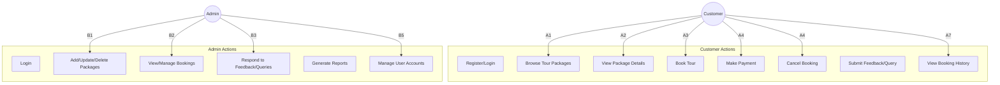
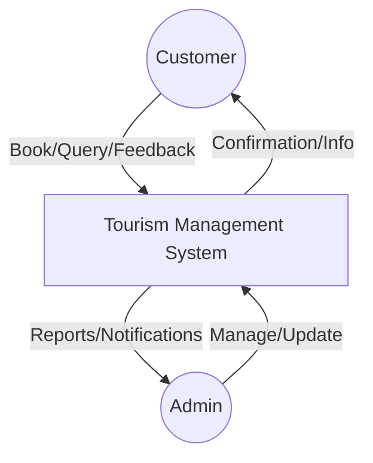
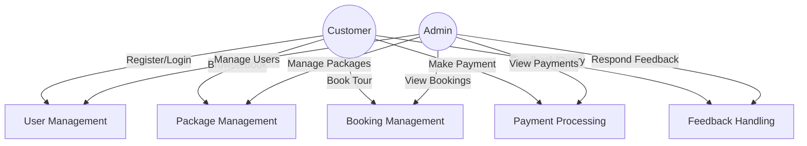
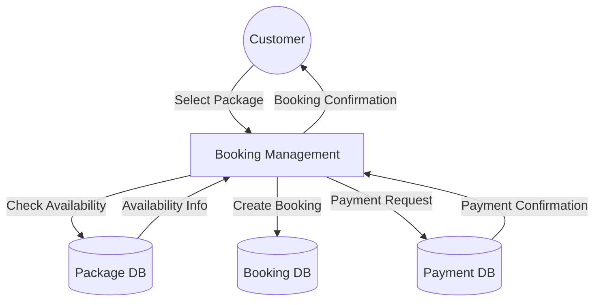
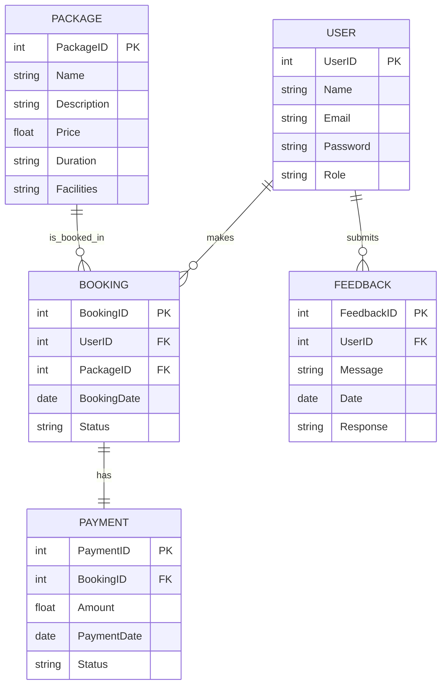

## 1. INTRODUCTION
### 1.1 Project Overview
The Tourism Management System mini project is designed to simplify and digitalize the process of managing tours and travel services. It allows tourists to browse destinations, select tour packages, book tickets, and reserve hotels conveniently. It helps travel agencies manage customer details, bookings, payments, and package information efficiently, reducing manual work and providing accurate information to both customers and agencies. This mini project demonstrates the core features of a real-world tourism application in a simple and user-friendly manner.

## 2. SYSTEM ANALYSIS
System analysis examines the current situation to improve it through better processes and methods. It involves gathering and interpreting facts, diagnosing problems, and recommending changes. Before computerizing a system, it must be analyzed to understand its current functioning, problems, and requirements.

### 2.1 Problem Analysis
Manual management of tourism activities leads to errors, confusion, double bookings, missing information, and poor coordination. Tourists struggle to get updated information, reducing satisfaction. The manual process is slow, inefficient, and unreliable. The Tourism Management System solves these problems by organizing data, improving booking accuracy, and making information accessible.

#### 2.1.1 Existing System
- Paper-based or spreadsheet tracking
- Manual communication
- No real-time updates
- Poor integration of services
- Risk of human error

#### 2.1.2 Proposed System
- Web-based platform for tourists and admins
- User registration, package browsing, online bookings, and queries
- Admin management of packages, bookings, payments, and inquiries
- Modules: registration/login, package listing, booking, payment, admin dashboard, feedback/support
- Technology: HTML, CSS, JavaScript, PHP, MySQL, Apache

#### 2.1.3 Feasibility Study
Feasibility study identifies the best system to meet requirements. It includes:
- Economic Feasibility: Benefits outweigh costs (reduced paperwork, fewer errors, faster operations, better customer handling)
- Technical Feasibility: Uses widely available technologies, no high-end hardware needed, easy to train staff
- Behavioural Feasibility: Designed for end-users, easy to use, improves satisfaction, likely to be accepted

### 2.2 Requirement Specification
Requirement analysis studies the current process to find improvements. It involves preliminary and detailed analysis, leading to a requirements specification that guides software design.

#### 2.2.1 Software Requirement Specification
- Functional Requirements: View packages, register/login, manage profiles, book/cancel tours, generate invoices, admin management, reporting
- Non-Functional Requirements: Usability, reliability, performance, security, scalability, availability

### 2.3 Hardware and Software Selection and Justification
#### 2.3.1 Hardware Specification
- Processor: Intel core i3 and above
- RAM: Minimum 4 GB
- Hard Disk: 100 GB
- Input: Mouse, Keyboard
- Output: Monitor, Audio device

#### 2.3.2 Software Selection and Justification
- OS: Windows 7 or higher
- Front End: HTML, JavaScript, CSS
- Back End: PHP, MySQL
- Browser: Chrome/Firefox/IE
- Web Server: WAMP

#### About the Backend
- **PHP**: Server-side scripting, dynamic content, database interaction, open-source, fast, secure, flexible
- **MySQL**: Open-source RDBMS, relational data, SQL, scalable, widely used

#### About the Frontend
- **HTML**: Structure and content
- **JavaScript**: Interactivity and client-side logic
- **CSS**: Styling and layout

### 2.4 Use Case Diagram
Below is the use case diagram for the Tourism Management System, represented as a Mermaid flowchart for compatibility:



### 2.5 Data Flow Diagram
#### Level 0 (Context Diagram)


#### Level 1 (Main Processes)


#### Level 2 (Booking Management Example)


### 2.6 Entity Relationship Diagram
Below is the ER diagram for the Tourism Management System, represented in Mermaid syntax:



---

## 3. SYSTEM DESIGN
System design provides the technical specification for implementing the system. It translates requirements into operational solutions, focusing on output, input, and database design.

### 3.1 Structured Design Methodologies
Design methodology uses brainstorming, analysis, and testing to meet user needs. Input validation and clear output forms are emphasized.

### 3.2 User Interface Design
- Simple, clean, and user-friendly interface
- Login page for customers/admins
- Dashboard for main features
- Tour packages page with details
- Booking page with forms
- Admin panel for management
- Search option for tours
- Responsive layout for all devices

### 3.3 Database Design
- Centralized, well-organized database
- Fast response, low redundancy, accuracy, integrity
- Relational tables for users, packages, bookings, etc.
- Normalization (up to 3NF)

#### 3.3.1 Data and Integrity Constraints
- Primary Key: Unique identifier
- Foreign Key: References primary key
- Normalization: Reduces redundancy, improves integrity

### 3.4 Output Design
- Booking confirmation page
- Admin reports (bookings, customers, tours, income)
- Tour package display
- Payment receipt
- Search results

### 3.5 Table Design
*Insert table structures and descriptions here*

---

## 4. CODING
### 4.1 Program Code Preparation
Coding translates design into a programming language. PHP is used for backend logic, MySQL for data storage. Code style, documentation, and efficiency are emphasized.

### 4.2 Implementation of Security
- Technical methods, reviews, testing, standards, record keeping
- Data integrity enforced by constraints
- Recordkeeping for all operations

#### 4.2.1 Data Security
- Well-organized database
- Access restricted to authorized users
- Test data and validation

#### 4.2.2 Users and Access Rights
- Admin: Full control (manage packages, bookings, payments, reports)
- Customer: Register, view packages, book/cancel, payments, booking history

---

## 5. SYSTEM TESTING
Testing ensures the system works accurately and efficiently. Includes:
- Unit Testing: Individual modules
- Integration Testing: Combined modules
- System Testing: Complete system
- Acceptance Testing: User validation
- Client-side and server-side validation

### 5.1 Unit Testing
- Test internal logic of modules
- White box testing

### 5.2 Integration Testing
- Test data flow between modules
- Ensure smooth integration

### 5.3 User Acceptance Testing
- Real users test features
- System meets user needs

### 5.4 Test Case Design
- Well-designed test cases for all features

### 5.5 Test Report and Debugging
- Debugging and error reporting
- Minimize useless information
- Avoid complex one-use testing code

---

## 6. SYSTEM IMPLEMENTATION AND MAINTENANCE
Implementation brings the system into operational use. Types:
1. Computer system replacing manual system
2. New computer system replacing existing one
3. Modified application replacing existing one

---

## 7. SCOPE OF PROJECT
The system simplifies planning and managing tours for customers and administrators. Customers can view, book, and pay for tours online. Admins manage packages, records, and reports. The system is suitable for travel agencies, tourism companies, and hotel chains, reducing paperwork and improving efficiency.

---

## 8. FUTURE ENHANCEMENTS
- Mobile app for bookings
- Live chat support
- Multi-language options
- Google Maps integration
- Review and rating features

---

## 9. CONCLUSION
The Tourism Management System simplifies and improves tourism service management. It provides a user-friendly platform for customers and efficient tools for administrators. Technology reduces manual work, errors, and improves satisfaction. Future enhancements can make the system even more powerful.

---

## 10. BIBLIOGRAPHY
- www.beginwebprogramming.com
- www.stackoverflow.com
- www.w3schools.com
- www.tutorialspoint.com

---

## APPENDIX I - Coding
Below are some sample code snippets from the Tourism Management System project.

### 1. User Registration (PHP)
```php
<?php
require('config.php');
if (isset($_POST['submit'])) {
    $username = $_POST['username'];
    $email = $_POST['email'];
    $password = md5($_POST['password']);
    $sql = "INSERT INTO users (username, email, password) VALUES ('$username', '$email', '$password')";
    if (mysqli_query($conn, $sql)) {
        echo "Registration successful!";
    } else {
        echo "Error: " . mysqli_error($conn);
    }
}
?>
```

### 2. User Login (PHP)
```php
<?php
require('config.php');
session_start();
if (isset($_POST['login'])) {
    $username = $_POST['username'];
    $password = md5($_POST['password']);
    $sql = "SELECT * FROM users WHERE username='$username' AND password='$password'";
    $result = mysqli_query($conn, $sql);
    if (mysqli_num_rows($result) == 1) {
        $_SESSION['username'] = $username;
        header('Location: dashboard.php');
    } else {
        echo "Invalid credentials!";
    }
}
?>
```

### 3. Booking a Tour (PHP)
```php
<?php
require('config.php');
session_start();
if (isset($_POST['book'])) {
    $user_id = $_SESSION['user_id'];
    $package_id = $_POST['package_id'];
    $date = date('Y-m-d');
    $sql = "INSERT INTO bookings (user_id, package_id, booking_date, status) VALUES ('$user_id', '$package_id', '$date', 'Pending')";
    if (mysqli_query($conn, $sql)) {
        echo "Booking successful!";
    } else {
        echo "Error: " . mysqli_error($conn);
    }
}
?>
```

### 4. Displaying Tour Packages (PHP + HTML)
```php
<?php
require('config.php');
$sql = "SELECT * FROM packages";
$result = mysqli_query($conn, $sql);
while ($row = mysqli_fetch_assoc($result)) {
    echo "<div class='package'>";
    echo "<h3>" . $row['name'] . "</h3>";
    echo "<p>" . $row['description'] . "</p>";
    echo "<p>Price: ₹" . $row['price'] . "</p>";
    echo "<form method='post' action='book.php'>";
    echo "<input type='hidden' name='package_id' value='" . $row['package_id'] . "'>";
    echo "<input type='submit' name='book' value='Book Now'>";
    echo "</form>";
    echo "</div>";
}
?>
```

## APPENDIX II - Forms and Screenshots
*Insert forms and screenshots here*
